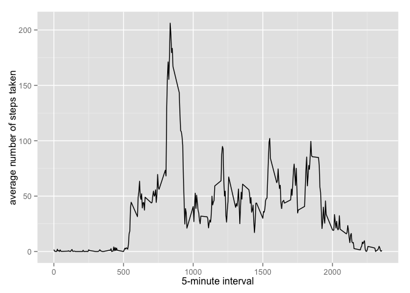
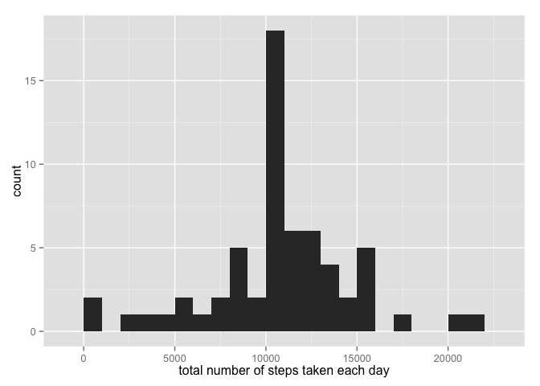
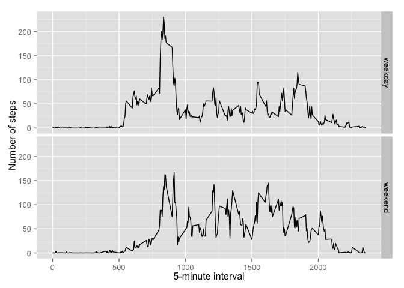

# Reproducible Research: Peer Assessment 1


## Loading and preprocessing the data


```r
# First unzipped the data- This can be done manually or 
# by using R code -> unzip(zipfile="activity.zip")
unzip(zipfile="activity.zip")
data <- read.csv("activity.csv")
```

## What is mean total number of steps taken per day?

```r
library(ggplot2)
total.steps <- tapply(data$steps, data$date, FUN=sum, na.rm=TRUE)
qplot(total.steps, binwidth=1000, xlab="total number of steps taken each day")
```

 

```r
mean(total.steps, na.rm=TRUE)
```

```
## [1] 9354.23
```

```r
median(total.steps, na.rm=TRUE)
```

```
## [1] 10395
```

## What is the average daily activity pattern?

```r
library(ggplot2)
averages <- aggregate(x=list(steps=data$steps), by=list(interval=data$interval),
                      FUN=mean, na.rm=TRUE)
ggplot(data=averages, aes(x=interval, y=steps)) + 
        geom_line() +
        xlab("5-minute interval") +
        ylab("average number of steps taken")
```

 


Which 5-minute interval, on average across all the days in the dataset, contains the 
maximum number of steps?

```r
averages[which.max(averages$steps),]
```

```
##     interval    steps
## 104      835 206.1698
```

## Imputing missing values

```r
missing <- is.na(data$steps)
# To find out how many records are missing
table(missing)
```

```
## missing
## FALSE  TRUE 
## 15264  2304
```

```r
# The missing values are filled in with mean value for that 5 minute interval
fill.value <- function(steps, interval) {
        filled <- NA
             if (!is.na(steps))
                 filled <- c(steps)
             else
                 filled <- (averages[averages$interval==interval, "steps"])
             return(filled)
        }
filled.data <- data
filled.data$steps <- mapply(fill.value, filled.data$steps, filled.data$interval)
```


```r
# Using the filled data set, create a histogram of the total number of steps taken each day and 
# calculate the mean and median total number of steps.

 total.steps <- tapply(filled.data$steps, filled.data$date, FUN=sum)
 qplot(total.steps, binwidth=1000, xlab="total number of steps taken each day")
```

 

```r
 mean(total.steps)
```

```
## [1] 10766.19
```

```r
 median(total.steps)
```

```
## [1] 10766.19
```
Mean and median values are higher after imputing the missing data. Before imputing
the missing values were set to 0s by default where as after imputing they are 
replaced by the mean of the corresponding ineterval.

## Are there differences in activity patterns between weekdays and weekends?
Finding the day of the week for each measurement in the dataset by using the 
dataset with the filled-in values.


```r
weekday.or.weekend <- function(date) {
    day <- weekdays(date)
    if (day %in% c("Monday", "Tuesday", "Wednesday", "Thursday", "Friday"))
        return("weekday")
    else if (day %in% c("Saturday", "Sunday"))
        return("weekend")
    else
        stop("invalid date")
}
filled.data$date <- as.Date(filled.data$date)
filled.data$day <- sapply(filled.data$date, FUN=weekday.or.weekend)
```

Create a panel plot containing plots of average number of steps taken
on weekdays and weekends.

```r
averages <- aggregate(steps ~ interval + day, data=filled.data, mean)
ggplot(averages, aes(interval, steps)) + geom_line() + facet_grid(day ~ .) +
    xlab("5-minute interval") + ylab("Number of steps")
```

 
